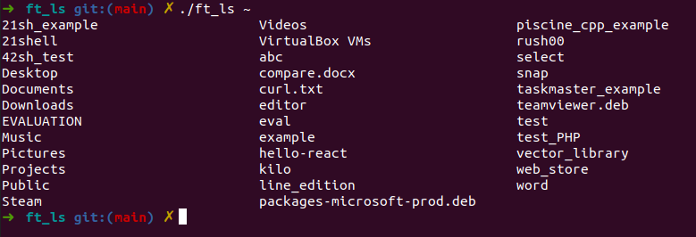

# 🌱 ft_ls
<strong>Status: Finished</strong><br/>
🥅 A recreation of ls command in Unix system. <br/>
<div></div>


☑️ -l, -R, -a, -r and -t options <br/>
☑️ Management of the columns <br/>

## Usage

```bash
$ make
$ ./ft_ls [options]
```
